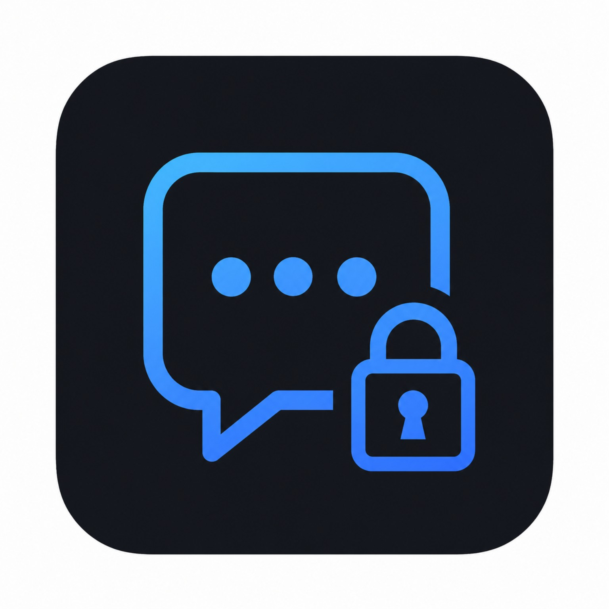

<!-- markdownlint-disable MD033 MD041 -->

<p align="center">
  
</p>

<h1 align="center">Chat NoControl</h1>

<p align="center">
  Encrypt text and files in your browser. No account, message server, tracking,
  or cloud history.
</p>

<p align="center">
  <a href="https://levi-cm.github.io/chat-nocontrol/">
    <strong>Open the live beta preview</strong>
  </a>
  ·
  <a href="docs/user-guide.en.md">English guide</a>
  ·
  <a href="docs/user-guide.de.md">Deutsche Anleitung</a>
</p>

<p align="center">
  
  
  
</p>

<!-- markdownlint-enable MD033 MD041 -->

> [!WARNING]
> Chat NoControl is a beta preview, not a stable or independently reviewed
> release. Do not rely on it for high-risk secrets. Read the
> [security notes](SECURITY.md) and [current project status](docs/implementation-status.md)
> before evaluating it for real use.

## What is Chat NoControl?

Chat NoControl is an accountless tool for exchanging encrypted text and files.
Encryption and decryption happen locally in your browser. You move the encrypted
result through any channel you already use: email, chat, USB storage, a QR code,
or something else.

It is deliberately not a messaging platform. There is no Chat NoControl server
holding accounts, contacts, messages, or keys.

## How it works

1. **Create or restore an identity.** Save the recovery materials and choose
   whether to keep an encrypted browser vault.
2. **Exchange public contacts.** Shareable QR codes or files let people encrypt
   something specifically for you.
3. **Encrypt and decrypt locally.** Copy or download the encrypted output, send
   it using another channel, then let the recipient open it in Chat NoControl.

## What you can do

- Encrypt text up to `256 KiB` and files up to `100 MiB` for one recipient.
- Add an optional file caption up to `16 KiB`.
- Exchange public contacts by QR code, image, or file.
- Save an encrypted identity vault in the browser or use session-only mode.
- Recover an identity from a private QR, `.ppxrecovery` file, recovery code, or
  24 English recovery words.
- Receive compact encrypted-message QR codes. Creating them is an optional
  setting and remains off by default.
- Use the installed app shell offline after it has loaded successfully once.
- Use the interface in English or German on desktop and mobile browsers.

## Protect your recovery material

> [!CAUTION]
> A private recovery QR, `.ppxrecovery` file, recovery code, set of 24 recovery
> words, and recovery sheet all grant the power to restore your identity.
> Anyone who gets one may decrypt messages intended for that identity.

Recovery QR codes, `.ppxrecovery` files, recovery codes, and recovery words are
not protected by the browser-vault password. Store them like private keys. The
recovery PDF also contains the separate browser-vault password; never share it.

If every recovery copy and the remembered browser vault are lost, the identity
and messages encrypted for it cannot be recovered.

## Privacy and security

Chat NoControl has no backend, relay, account service, key server, analytics,
telemetry, remote fonts, remote scripts, crash reporting, or cloud sync. The
static app performs cryptographic work in dedicated browser workers and stores
data locally only when you choose to.

PPX currently combines:

- **ML-KEM-512 + X25519** for hybrid confidentiality.
- **Ed25519** for classical sender authentication.
- **AES-256-GCM** for encrypted content and integrity protection.
- Strict, versioned binary formats with bounded parsers and size limits.

These are narrow implementation claims, not a promise that the product is
quantum-proof or equivalent to Signal. Security still depends on an
uncompromised device and browser, authentic public contacts, safe recovery
storage, and independent review of the exact release.

### Important limits

| Chat NoControl has | Chat NoControl does not have |
| --- | --- |
| One active identity | Accounts or cloud identity recovery |
| One recipient per output | Group or multi-recipient messaging |
| Portable encrypted text and files | Delivery service or message history |
| Classical sender signatures | Post-quantum signatures |
| Local encrypted vault storage | Forward secrecy, ratchet, or secure deletion |

See the full [security architecture](docs/security-architecture.md) and
[threat model](docs/threat-model.md) for exact boundaries.

## Current project status

- Repository version: **`0.1.0-beta.1`**.
- Core identity, recovery, contact, text, file, QR, offline, English, and German
  flows are implemented.
- The Pages site is a live preview, not a recorded reviewed release.
- The latest local checkpoint records a timeout in the long browser suite's
  recovery-QR path, while focused reruns passed.
- Physical-device QR evidence, completed independent review, signed release
  provenance, and final deployment evidence remain open release gates.

Follow [implementation status](docs/implementation-status.md) for current test
evidence and blockers. GitHub [Releases](https://github.com/levi-cm/chat-nocontrol/releases)
is the source for any future published release.

## For protocol enthusiasts

PPX uses small, versioned objects for different jobs:

| Object | Purpose |
| --- | --- |
| `PPXC` | Shareable public contact |
| `PPXT` | Encrypted text |
| `PPXF` | Encrypted file and optional caption |
| `PPXQ` | Compact encrypted-message QR |
| `PPXR` | Unencrypted identity recovery object |
| `PPXV` | Password-encrypted identity vault |

Start with [PPX Protocol v1](docs/protocol-v1.md). Adaptive text compression is
documented in [Protocol v2](docs/protocol-v2.md), and compact message QR details
live in the [PPXQ protocol document](docs/protocol-qr-message-v1.md).

## Local development

Requirements:

- Node.js `^22.12.0` or `>=24.0.0`
- npm
- Tailscale for the default phone-friendly HTTPS development command

```bash
npm ci
npm run dev
```

The default command binds Vite to `127.0.0.1:5173` and exposes it through
foreground Tailscale Serve. It prints the HTTPS URL to open. HTTPS is required
for reliable camera and clipboard permissions on phones.

For explicit raw-LAN testing, `npm run dev:lan` binds to `0.0.0.0`. This exposes
the development server more broadly, and camera or clipboard features may not
work over plain HTTP.

Useful checks:

```bash
npm run build
npm run test
npm run verify:quality
npm run verify
```

`npm run verify:quality` runs the full local quality suite. `npm run verify`
also enforces independent-review, release, SBOM, and reproducibility gates, so
it correctly remains blocked until genuine release evidence exists.

## Learn more

- [English user guide](docs/user-guide.en.md)
- [German user guide](docs/user-guide.de.md)
- [Product specification](docs/product-spec.md)
- [Security architecture](docs/security-architecture.md)
- [Threat model](docs/threat-model.md)
- [Testing and release contract](docs/testing-and-release.md)
- [Contributing](CONTRIBUTING.md)
- [Security reporting](SECURITY.md)

## License

Chat NoControl is licensed under
[AGPL-3.0-or-later](LICENSE).
